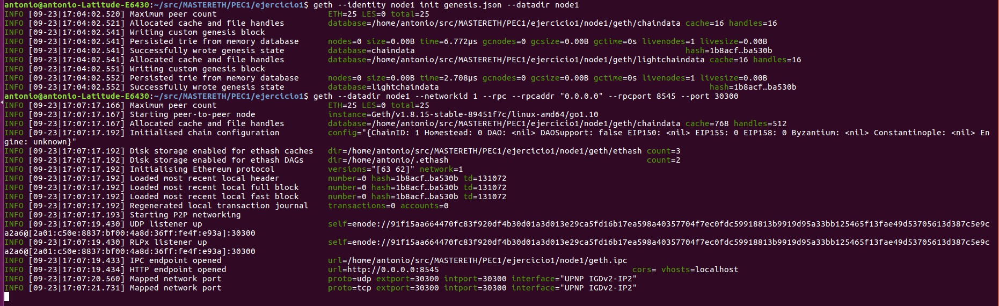
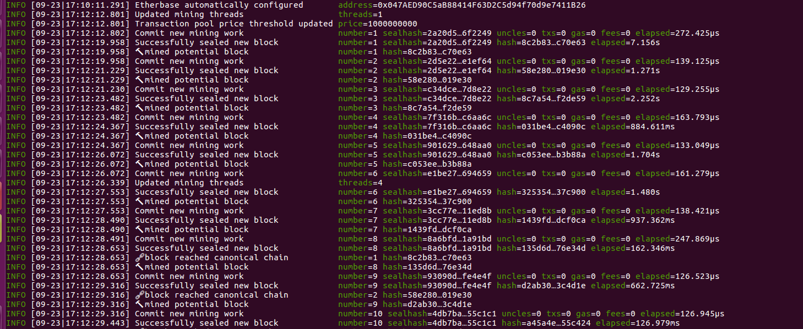

# PEC1:

## Ejercicio 1: 

### Archivo genesis y pantallazo del cliente Geth al inicio de la sincronización

####  1. Creamos un directorio para el nodo de nuestra red.	
>     mkdir node1

####  2. Creamos el fichero genesis.json

>
	{
	    "config": {
		"chainId": 1,
		"homesteadBlock": 0,
		"eip155Block": 0,
		"eip158Block": 0
	    },
	    "alloc": {
	      },
	    "coinbase"   : "0x0000000000000000000000000000000000000000",
	    "difficulty" : "0x20000",
	    "extraData"  : "",
	    "gasLimit"   : "0x2fefd8",
	    "nonce"   : "0x0000000000000097",
	    "mixhash" : "0x0000000000000000000000000000000000000000000000000000000000000000",
	    "parentHash" : "0x0000000000000000000000000000000000000000000000000000000000000000",
	    "timestamp"  : "0x00"
	}
	

####  3. Instanciamos el nodo de nuestra blockchain e iniciamos la sincronización:
       
>       geth --identity node1 init genesis.json --datadir node1
  
  

>      geth --datadir node1 --networkid 1 --rpc --rpcaddr "0.0.0.0" --rpcport 8545 --port 30300
    
   

### Balance de la cuenta creada

####  4. Nos conectamos al nodo 1 
>       geth attach ./node1/geth.ipc
   
   

####  5. Creamos la cuenta para recibir la recompensa del minado

>       personal.newAccount()
   
   
  
####  6. Comprobamos el balance de la cuenta antes de iniciar  el minado 
>      eth.coinbase 
>      eth.getBalance(eth.coinbase)
   
   

####  7. Iniciamos el minado y comprobamos el balance de la cuenta tras unos minutos
>      miner.start(1)
 
   

>      miner.stop()
>      eth.getBalance(eth.coinbase)
>      web3.fromWei(eth.getBalance(eth.coinbase).toString(),'ether') 
     
   
   
~~~ 
El balance de la cuenta tras el minado es 580 ETH
~~~

