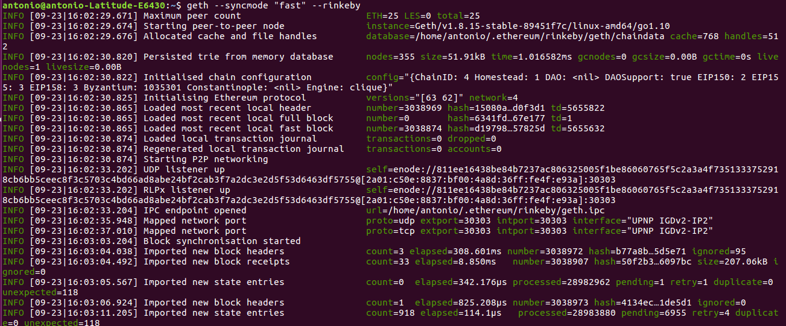
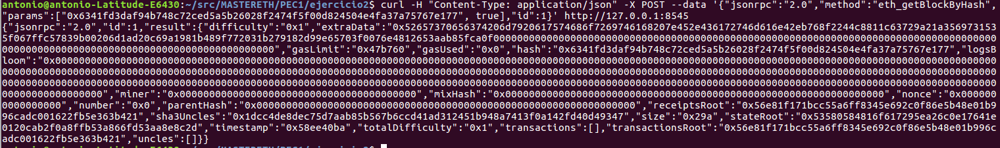
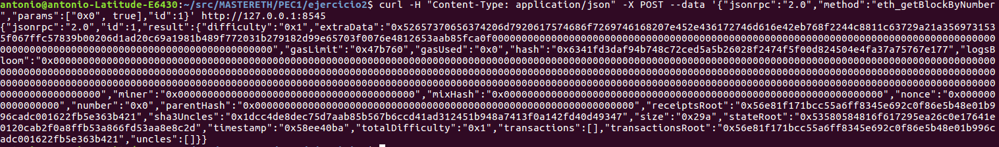

# PEC1:

## Ejercicio 2: 

### Información Bloque Genesis de la red Rinkeby

####  1. Iniciamos geth con el modo rinkeby 	
>     geth --syncmode "fast" --rinkeby
   

####  2. Desde otro terminal obtenemos la consola
>     geth --datadir=$HOME/.ethereum/rinkeby attach ipc:$HOME/.ethereum/rinkeby/geth.ipc console

   

####  3.Desde la consola obtenemos información del nodo
>     admin.nodeInfo

~~~
Hash del bloque genesis: "0x6341fd3daf94b748c72ced5a5b26028f2474f5f00d824504e4fa37a75767e177"
~~~

   
    
####  4.Utilizamos JSON RPC API para obtener información sobre el bloque genesis
>     admin.startRPC("127.0.0.1", 8545)
~~~
Obtenemos información sobre el bloque 0 llamando al método eth_getBlockByHash:
~~~
>	curl -H "Content-Type: application/json" -X POST --data '{"jsonrpc":"2.0","method":"eth_getBlockByHash","params":["0x6341fd3daf94b748c72ced5a5b26028f2474f5f00d824504e4fa37a75767e177", true],"id":1}' http://127.0.0.1:8545

   

~~~
Podemos obtener la misma información con el método eth_getBlockByNumber:
~~~
>	curl -H "Content-Type: application/json" -X POST --data '{"jsonrpc":"2.0","method":"eth_getBlockByNumber","params":["0x0", true],"id":1}' http://127.0.0.1:8545

>	admin.stopRPC()

   

~~~
Las llamadas a eth_getBlockByNumber y eth_getBlockByHash devuelven el mismo resultado que eth.getBlock(0).
~~~
>	eth.getBlock(0)

   

~~~
Si por ejemplo nos fijamos en el valor de gaslimit en hex: 0x47b760 -> al transformarlo en decimal coincide con el valor devuelto por eth.getBlock(0) -> 4700000
~~~

### Cantidad de peers a los que el nodo está conectado

>	web3.net.peerCount 
~~~
El nodo está conectado a 2 peers
~~~

   

### Información acerca de los peers y altura máxima de bloque de los peers

>	admin.peers 

   

~~~
Desde https://rinkeby.etherscan.io podemos obtener la altura del peer id: 343149e4feefa15d882d9fe4ac7d88f885bd05ebb735e547f12e12080a9fa07c8014ca6fd7f373123488102fe5e34111f8509cf0b7de3f5b44339c9f25e87cb8
mediante el valor del head: "0x3e9cb6b5bb3bd2c818a590229dfdbd23387558c51665b4aa0d0c82e9a1bacdf0"

https://rinkeby.etherscan.io/block/0x3e9cb6b5bb3bd2c818a590229dfdbd23387558c51665b4aa0d0c82e9a1bacdf0
~~~
>	**Height: 3017748**
  
 

~~~
Desde https://rinkeby.etherscan.io podemos obtener la altura del peer id: a24ac7c5484ef4ed0c5eb2d36620ba4e4aa13b8c84684e1b4aab0cebea2ae45cb4d375b77eab56516d34bfbd3c1a833fc51296ff084b770b94fb9028c4d25ccf
mediante el valor del head: "0x65de39381bbaddc013d7b32d12e6abdce9eedc5768baf87ea9442ff71c56f392"

https://rinkeby.etherscan.io/block/0x65de39381bbaddc013d7b32d12e6abdce9eedc5768baf87ea9442ff71c56f392
~~~
>	**Height: 3017766**
  
 

