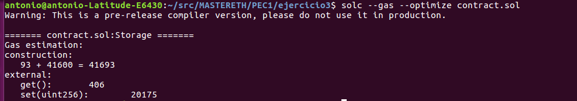

# PEC1:

## Ejercicio 3: 

### Códigos de operación del contrato inteligente

>    Smart contract: contract.sol

~~~
pragma solidity ^0.4.0;
contract Storage {
    uint storedData;

    function set(uint x) public {
        storedData = x;
    }

    function get() public view returns (uint) {
        return storedData;
    }
}
~~~

####  1. A partir del smart contract obtenemos el bytecode
>     solc -o outputDirectory --bin --optimize contract.sol

> 
608060405234801561001057600080fd5b5060d08061001f6000396000f3fe60806040526004361060485763ffffffff7c010000000000000000000000000000000000000000000000000000000060003504166360fe47b18114604d5780636d4ce63c146075575b600080fd5b348015605857600080fd5b50607360048036036020811015606d57600080fd5b50356099565b005b348015608057600080fd5b506087609e565b60408051918252519081900360200190f35b600055565b6000549056fea165627a7a723058203df6ac8f124c635f3800e868a352cbdca8eb89601f7e5d8fcf29b54b4b6721880029

####  2. Obtenemos los códigos de operación correspondientes (OPCODES)
       
>       solc -o outputDirectory --opcodes --optimize contract.sol
  

>
PUSH1 0x80 PUSH1 0x40 MSTORE CALLVALUE DUP1 ISZERO PUSH2 0x10 JUMPI PUSH1 0x0 DUP1 REVERT JUMPDEST POP PUSH1 0xD0 DUP1 PUSH2 0x1F PUSH1 0x0 CODECOPY PUSH1 0x0 RETURN INVALID PUSH1 0x80 PUSH1 0x40 MSTORE PUSH1 0x4 CALLDATASIZE LT PUSH1 0x48 JUMPI PUSH4 0xFFFFFFFF PUSH29 0x100000000000000000000000000000000000000000000000000000000 PUSH1 0x0 CALLDATALOAD DIV AND PUSH4 0x60FE47B1 DUP2 EQ PUSH1 0x4D JUMPI DUP1 PUSH4 0x6D4CE63C EQ PUSH1 0x75 JUMPI JUMPDEST PUSH1 0x0 DUP1 REVERT JUMPDEST CALLVALUE DUP1 ISZERO PUSH1 0x58 JUMPI PUSH1 0x0 DUP1 REVERT JUMPDEST POP PUSH1 0x73 PUSH1 0x4 DUP1 CALLDATASIZE SUB PUSH1 0x20 DUP2 LT ISZERO PUSH1 0x6D JUMPI PUSH1 0x0 DUP1 REVERT JUMPDEST POP CALLDATALOAD PUSH1 0x99 JUMP JUMPDEST STOP JUMPDEST CALLVALUE DUP1 ISZERO PUSH1 0x80 JUMPI PUSH1 0x0 DUP1 REVERT JUMPDEST POP PUSH1 0x87 PUSH1 0x9E JUMP JUMPDEST PUSH1 0x40 DUP1 MLOAD SWAP2 DUP3 MSTORE MLOAD SWAP1 DUP2 SWAP1 SUB PUSH1 0x20 ADD SWAP1 RETURN JUMPDEST PUSH1 0x0 SSTORE JUMP JUMPDEST PUSH1 0x0 SLOAD SWAP1 JUMP INVALID LOG1 PUSH6 0x627A7A723058 KECCAK256 RETURNDATASIZE 0xf6 0xac DUP16 SLT 0x4c PUSH4 0x5F3800E8 PUSH9 0xA352CBDCA8EB89601F PUSH31 0x5D8FCF29B54B4B672188002900000000000000000000000000000000000000

~~~
También podemos obtener los OPCODES mediante EVM
~~~

>       evm disasm ./outputDirectory/Storage.bin run >> ./outputDirectory/evmStorage.opcode

   
~~~
608060405234801561001057600080fd5b5060d08061001f6000396000f3fe60806040526004361060485763ffffffff7c010000000000000000000000000000000000000000000000000000000060003504166360fe47b18114604d5780636d4ce63c146075575b600080fd5b348015605857600080fd5b50607360048036036020811015606d57600080fd5b50356099565b005b348015608057600080fd5b506087609e565b60408051918252519081900360200190f35b600055565b6000549056fea165627a7a723058203df6ac8f124c635f3800e868a352cbdca8eb89601f7e5d8fcf29b54b4b6721880029
000000: PUSH1 0x80
000002: PUSH1 0x40
000004: MSTORE
000005: CALLVALUE
000006: DUP1
000007: ISZERO
000008: PUSH2 0x0010
000011: JUMPI
000012: PUSH1 0x00
000014: DUP1
000015: REVERT
000016: JUMPDEST
000017: POP
000018: PUSH1 0xd0
000020: DUP1
000021: PUSH2 0x001f
000024: PUSH1 0x00
000026: CODECOPY
000027: PUSH1 0x00
000029: RETURN
000030: Missing opcode 0xfe
000031: PUSH1 0x80
000033: PUSH1 0x40
000035: MSTORE
000036: PUSH1 0x04
000038: CALLDATASIZE
000039: LT
000040: PUSH1 0x48
000042: JUMPI
000043: PUSH4 0xffffffff
000048: PUSH29 0x0100000000000000000000000000000000000000000000000000000000
000078: PUSH1 0x00
000080: CALLDATALOAD
000081: DIV
000082: AND
000083: PUSH4 0x60fe47b1
000088: DUP2
000089: EQ
000090: PUSH1 0x4d
000092: JUMPI
000093: DUP1
000094: PUSH4 0x6d4ce63c
000099: EQ
000100: PUSH1 0x75
000102: JUMPI
000103: JUMPDEST
000104: PUSH1 0x00
000106: DUP1
000107: REVERT
000108: JUMPDEST
000109: CALLVALUE
000110: DUP1
000111: ISZERO
000112: PUSH1 0x58
000114: JUMPI
000115: PUSH1 0x00
000117: DUP1
000118: REVERT
000119: JUMPDEST
000120: POP
000121: PUSH1 0x73
000123: PUSH1 0x04
000125: DUP1
000126: CALLDATASIZE
000127: SUB
000128: PUSH1 0x20
000130: DUP2
000131: LT
000132: ISZERO
000133: PUSH1 0x6d
000135: JUMPI
000136: PUSH1 0x00
000138: DUP1
000139: REVERT
000140: JUMPDEST
000141: POP
000142: CALLDATALOAD
000143: PUSH1 0x99
000145: JUMP
000146: JUMPDEST
000147: STOP
000148: JUMPDEST
000149: CALLVALUE
000150: DUP1
000151: ISZERO
000152: PUSH1 0x80
000154: JUMPI
000155: PUSH1 0x00
000157: DUP1
000158: REVERT
000159: JUMPDEST
000160: POP
000161: PUSH1 0x87
000163: PUSH1 0x9e
000165: JUMP
000166: JUMPDEST
000167: PUSH1 0x40
000169: DUP1
000170: MLOAD
000171: SWAP2
000172: DUP3
000173: MSTORE
000174: MLOAD
000175: SWAP1
000176: DUP2
000177: SWAP1
000178: SUB
000179: PUSH1 0x20
000181: ADD
000182: SWAP1
000183: RETURN
000184: JUMPDEST
000185: PUSH1 0x00
000187: SSTORE
000188: JUMP
000189: JUMPDEST
000190: PUSH1 0x00
000192: SLOAD
000193: SWAP1
000194: JUMP
000195: Missing opcode 0xfe
000196: LOG1
000197: PUSH6 0x627a7a723058
000204: SHA3
000205: RETURNDATASIZE
000206: Missing opcode 0xf6
000207: Missing opcode 0xac
000208: DUP16
000209: SLT
000210: Missing opcode 0x4c
000211: PUSH4 0x5f3800e8
000216: PUSH9 0xa352cbdca8eb89601f
~~~

### Identificadores de las funciones que existan dentro del contrato inteligente. 

####  3.
>       solc -o outputDirectory --hashes --optimize contract.sol
   

~~~
6d4ce63c: get()
60fe47b1: set(uint256)
~~~

### Estimación del gas utilizado por cada función. 

####  4.
>       solc --gas --optimize contract.sol
   
   

