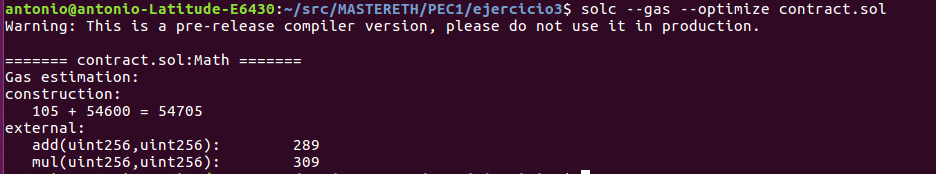

# PEC1:

## Ejercicio 3: 

### Códigos de operación del contrato inteligente

>    Smart contract: contract.sol

~~~
pragma solidity ^0.4.25;

contract Math {

    function mul(uint256 a, uint256 b) public pure returns (uint256) {
        if (a == 0) {
            return 0;
        }
        uint256 c = a * b;
        return c;
    }
  
    function add(uint256 a, uint256 b) public pure returns (uint256) {
        uint256 c = a + b;
        require(c >= a);
        return c;
    }
}
~~~

####  1. A partir del smart contract obtenemos el bytecode
>     solc -o outputDirectory --bin --optimize contract.sol

~~~
608060405234801561001057600080fd5b50610111806100206000396000f3fe60806040526004361060485763ffffffff7c0100000000000000000000000000000000000000000000000000000000600035041663771602f78114604d578063c8a4ac9c14608b575b600080fd5b348015605857600080fd5b50607960048036036040811015606d57600080fd5b508035906020013560b7565b60408051918252519081900360200190f35b348015609657600080fd5b5060796004803603604081101560ab57600080fd5b508035906020013560d1565b60008282018381101560c857600080fd5b90505b92915050565b600082151560e05750600060cb565b50029056fea165627a7a723058200b82c4a3087addce6a53c9d0972fcf75647dfa341c0fa176f5f5e100cd42ccde0029
~~~

####  2. Obtenemos los códigos de operación correspondientes (OPCODES)
       
>       solc -o outputDirectory --opcodes --optimize contract.sol
  

~~~
PUSH1 0x80 PUSH1 0x40 MSTORE CALLVALUE DUP1 ISZERO PUSH2 0x10 JUMPI PUSH1 0x0 DUP1 REVERT JUMPDEST POP PUSH2 0x111 DUP1 PUSH2 0x20 PUSH1 0x0 CODECOPY PUSH1 0x0 RETURN INVALID PUSH1 0x80 PUSH1 0x40 MSTORE PUSH1 0x4 CALLDATASIZE LT PUSH1 0x48 JUMPI PUSH4 0xFFFFFFFF PUSH29 0x100000000000000000000000000000000000000000000000000000000 PUSH1 0x0 CALLDATALOAD DIV AND PUSH4 0x771602F7 DUP2 EQ PUSH1 0x4D JUMPI DUP1 PUSH4 0xC8A4AC9C EQ PUSH1 0x8B JUMPI JUMPDEST PUSH1 0x0 DUP1 REVERT JUMPDEST CALLVALUE DUP1 ISZERO PUSH1 0x58 JUMPI PUSH1 0x0 DUP1 REVERT JUMPDEST POP PUSH1 0x79 PUSH1 0x4 DUP1 CALLDATASIZE SUB PUSH1 0x40 DUP2 LT ISZERO PUSH1 0x6D JUMPI PUSH1 0x0 DUP1 REVERT JUMPDEST POP DUP1 CALLDATALOAD SWAP1 PUSH1 0x20 ADD CALLDATALOAD PUSH1 0xB7 JUMP JUMPDEST PUSH1 0x40 DUP1 MLOAD SWAP2 DUP3 MSTORE MLOAD SWAP1 DUP2 SWAP1 SUB PUSH1 0x20 ADD SWAP1 RETURN JUMPDEST CALLVALUE DUP1 ISZERO PUSH1 0x96 JUMPI PUSH1 0x0 DUP1 REVERT JUMPDEST POP PUSH1 0x79 PUSH1 0x4 DUP1 CALLDATASIZE SUB PUSH1 0x40 DUP2 LT ISZERO PUSH1 0xAB JUMPI PUSH1 0x0 DUP1 REVERT JUMPDEST POP DUP1 CALLDATALOAD SWAP1 PUSH1 0x20 ADD CALLDATALOAD PUSH1 0xD1 JUMP JUMPDEST PUSH1 0x0 DUP3 DUP3 ADD DUP4 DUP2 LT ISZERO PUSH1 0xC8 JUMPI PUSH1 0x0 DUP1 REVERT JUMPDEST SWAP1 POP JUMPDEST SWAP3 SWAP2 POP POP JUMP JUMPDEST PUSH1 0x0 DUP3 ISZERO ISZERO PUSH1 0xE0 JUMPI POP PUSH1 0x0 PUSH1 0xCB JUMP JUMPDEST POP MUL SWAP1 JUMP INVALID LOG1 PUSH6 0x627A7A723058 KECCAK256 SIGNEXTEND DUP3 0xc4 LOG3 ADDMOD PUSH27 0xDDCE6A53C9D0972FCF75647DFA341C0FA176F5F5E100CD42CCDE00 0x29 
~~~

~~~
También podemos obtener los OPCODES mediante EVM
~~~

>       evm disasm ./outputDirectory/Math.bin run >> ./outputDirectory/evmMath.opcode

   
~~~
608060405234801561001057600080fd5b50610111806100206000396000f3fe60806040526004361060485763ffffffff7c0100000000000000000000000000000000000000000000000000000000600035041663771602f78114604d578063c8a4ac9c14608b575b600080fd5b348015605857600080fd5b50607960048036036040811015606d57600080fd5b508035906020013560b7565b60408051918252519081900360200190f35b348015609657600080fd5b5060796004803603604081101560ab57600080fd5b508035906020013560d1565b60008282018381101560c857600080fd5b90505b92915050565b600082151560e05750600060cb565b50029056fea165627a7a723058200b82c4a3087addce6a53c9d0972fcf75647dfa341c0fa176f5f5e100cd42ccde0029
000000: PUSH1 0x80
000002: PUSH1 0x40
000004: MSTORE
000005: CALLVALUE
000006: DUP1
000007: ISZERO
000008: PUSH2 0x0010
000011: JUMPI
000012: PUSH1 0x00
000014: DUP1
000015: REVERT
000016: JUMPDEST
000017: POP
000018: PUSH2 0x0111
000021: DUP1
000022: PUSH2 0x0020
000025: PUSH1 0x00
000027: CODECOPY
000028: PUSH1 0x00
000030: RETURN
000031: Missing opcode 0xfe
000032: PUSH1 0x80
000034: PUSH1 0x40
000036: MSTORE
000037: PUSH1 0x04
000039: CALLDATASIZE
000040: LT
000041: PUSH1 0x48
000043: JUMPI
000044: PUSH4 0xffffffff
000049: PUSH29 0x0100000000000000000000000000000000000000000000000000000000
000079: PUSH1 0x00
000081: CALLDATALOAD
000082: DIV
000083: AND
000084: PUSH4 0x771602f7
000089: DUP2
000090: EQ
000091: PUSH1 0x4d
000093: JUMPI
000094: DUP1
000095: PUSH4 0xc8a4ac9c
000100: EQ
000101: PUSH1 0x8b
000103: JUMPI
000104: JUMPDEST
000105: PUSH1 0x00
000107: DUP1
000108: REVERT
000109: JUMPDEST
000110: CALLVALUE
000111: DUP1
000112: ISZERO
000113: PUSH1 0x58
000115: JUMPI
000116: PUSH1 0x00
000118: DUP1
000119: REVERT
000120: JUMPDEST
000121: POP
000122: PUSH1 0x79
000124: PUSH1 0x04
000126: DUP1
000127: CALLDATASIZE
000128: SUB
000129: PUSH1 0x40
000131: DUP2
000132: LT
000133: ISZERO
000134: PUSH1 0x6d
000136: JUMPI
000137: PUSH1 0x00
000139: DUP1
000140: REVERT
000141: JUMPDEST
000142: POP
000143: DUP1
000144: CALLDATALOAD
000145: SWAP1
000146: PUSH1 0x20
000148: ADD
000149: CALLDATALOAD
000150: PUSH1 0xb7
000152: JUMP
000153: JUMPDEST
000154: PUSH1 0x40
000156: DUP1
000157: MLOAD
000158: SWAP2
000159: DUP3
000160: MSTORE
000161: MLOAD
000162: SWAP1
000163: DUP2
000164: SWAP1
000165: SUB
000166: PUSH1 0x20
000168: ADD
000169: SWAP1
000170: RETURN
000171: JUMPDEST
000172: CALLVALUE
000173: DUP1
000174: ISZERO
000175: PUSH1 0x96
000177: JUMPI
000178: PUSH1 0x00
000180: DUP1
000181: REVERT
000182: JUMPDEST
000183: POP
000184: PUSH1 0x79
000186: PUSH1 0x04
000188: DUP1
000189: CALLDATASIZE
000190: SUB
000191: PUSH1 0x40
000193: DUP2
000194: LT
000195: ISZERO
000196: PUSH1 0xab
000198: JUMPI
000199: PUSH1 0x00
000201: DUP1
000202: REVERT
000203: JUMPDEST
000204: POP
000205: DUP1
000206: CALLDATALOAD
000207: SWAP1
000208: PUSH1 0x20
000210: ADD
000211: CALLDATALOAD
000212: PUSH1 0xd1
000214: JUMP
000215: JUMPDEST
000216: PUSH1 0x00
000218: DUP3
000219: DUP3
000220: ADD
000221: DUP4
000222: DUP2
000223: LT
000224: ISZERO
000225: PUSH1 0xc8
000227: JUMPI
000228: PUSH1 0x00
000230: DUP1
000231: REVERT
000232: JUMPDEST
000233: SWAP1
000234: POP
000235: JUMPDEST
000236: SWAP3
000237: SWAP2
000238: POP
000239: POP
000240: JUMP
000241: JUMPDEST
000242: PUSH1 0x00
000244: DUP3
000245: ISZERO
000246: ISZERO
000247: PUSH1 0xe0
000249: JUMPI
000250: POP
000251: PUSH1 0x00
000253: PUSH1 0xcb
000255: JUMP
000256: JUMPDEST
000257: POP
000258: MUL
000259: SWAP1
000260: JUMP
000261: Missing opcode 0xfe
000262: LOG1
000263: PUSH6 0x627a7a723058
000270: SHA3
000271: SIGNEXTEND
000272: DUP3
000273: Missing opcode 0xc4
000274: LOG3
000275: ADDMOD
000276: PUSH27 0xddce6a53c9d0972fcf75647dfa341c0fa176f5f5e100cd42ccde00
000304: Missing opcode 0x29

~~~

### Identificadores de las funciones que existan dentro del contrato inteligente. 

####  3.
>       solc -o outputDirectory --hashes --optimize contract.sol
   

~~~
771602f7: add(uint256,uint256)
c8a4ac9c: mul(uint256,uint256)
~~~

### Estimación del gas utilizado por cada función. 

####  4.
>       solc --gas --optimize contract.sol
   
   

~~~
También podemos obtener el coste del gas consumido por cada función mediante el cálculo del coste del gas de cada instrucción/OPCODE.
En el caso de la suma (4+6) el coste total del gas es: 105
~~~

>       evm --debug --codefile ./outputDirectory/Math.bin --input 771602f700000000000000000000000000000000000000000000000000000000000000040000000000000000000000000000000000000000000000000000000000000006 run
~~~
0x60806040526004361060485763ffffffff7c0100000000000000000000000000000000000000000000000000000000600035041663771602f78114604d578063c8a4ac9c14608b575b600080fd5b348015605857600080fd5b50607960048036036040811015606d57600080fd5b508035906020013560b7565b60408051918252519081900360200190f35b348015609657600080fd5b5060796004803603604081101560ab57600080fd5b508035906020013560d1565b60008282018381101560c857600080fd5b90505b92915050565b600082151560e05750600060cb565b50029056fea165627a7a723058200b82c4a3087addce6a53c9d0972fcf75647dfa341c0fa176f5f5e100cd42ccde0029
#### TRACE ####
PUSH1           pc=00000000 gas=10000000000 cost=3

PUSH1           pc=00000002 gas=9999999997 cost=3
Stack:
00000000  0000000000000000000000000000000000000000000000000000000000000080

MSTORE          pc=00000004 gas=9999999994 cost=12
Stack:
00000000  0000000000000000000000000000000000000000000000000000000000000040
00000001  0000000000000000000000000000000000000000000000000000000000000080
Memory:
00000000  00 00 00 00 00 00 00 00  00 00 00 00 00 00 00 00  |................|
00000010  00 00 00 00 00 00 00 00  00 00 00 00 00 00 00 00  |................|
00000020  00 00 00 00 00 00 00 00  00 00 00 00 00 00 00 00  |................|
00000030  00 00 00 00 00 00 00 00  00 00 00 00 00 00 00 00  |................|
00000040  00 00 00 00 00 00 00 00  00 00 00 00 00 00 00 00  |................|
00000050  00 00 00 00 00 00 00 00  00 00 00 00 00 00 00 00  |................|

CALLVALUE       pc=00000005 gas=9999999982 cost=2
Memory:
00000000  00 00 00 00 00 00 00 00  00 00 00 00 00 00 00 00  |................|
00000010  00 00 00 00 00 00 00 00  00 00 00 00 00 00 00 00  |................|
00000020  00 00 00 00 00 00 00 00  00 00 00 00 00 00 00 00  |................|
00000030  00 00 00 00 00 00 00 00  00 00 00 00 00 00 00 00  |................|
00000040  00 00 00 00 00 00 00 00  00 00 00 00 00 00 00 00  |................|
00000050  00 00 00 00 00 00 00 00  00 00 00 00 00 00 00 80  |................|

DUP1            pc=00000006 gas=9999999980 cost=3
Stack:
00000000  0000000000000000000000000000000000000000000000000000000000000000
Memory:
00000000  00 00 00 00 00 00 00 00  00 00 00 00 00 00 00 00  |................|
00000010  00 00 00 00 00 00 00 00  00 00 00 00 00 00 00 00  |................|
00000020  00 00 00 00 00 00 00 00  00 00 00 00 00 00 00 00  |................|
00000030  00 00 00 00 00 00 00 00  00 00 00 00 00 00 00 00  |................|
00000040  00 00 00 00 00 00 00 00  00 00 00 00 00 00 00 00  |................|
00000050  00 00 00 00 00 00 00 00  00 00 00 00 00 00 00 80  |................|

ISZERO          pc=00000007 gas=9999999977 cost=3
Stack:
00000000  0000000000000000000000000000000000000000000000000000000000000000
00000001  0000000000000000000000000000000000000000000000000000000000000000
Memory:
00000000  00 00 00 00 00 00 00 00  00 00 00 00 00 00 00 00  |................|
00000010  00 00 00 00 00 00 00 00  00 00 00 00 00 00 00 00  |................|
00000020  00 00 00 00 00 00 00 00  00 00 00 00 00 00 00 00  |................|
00000030  00 00 00 00 00 00 00 00  00 00 00 00 00 00 00 00  |................|
00000040  00 00 00 00 00 00 00 00  00 00 00 00 00 00 00 00  |................|
00000050  00 00 00 00 00 00 00 00  00 00 00 00 00 00 00 80  |................|

PUSH2           pc=00000008 gas=9999999974 cost=3
Stack:
00000000  0000000000000000000000000000000000000000000000000000000000000001
00000001  0000000000000000000000000000000000000000000000000000000000000000
Memory:
00000000  00 00 00 00 00 00 00 00  00 00 00 00 00 00 00 00  |................|
00000010  00 00 00 00 00 00 00 00  00 00 00 00 00 00 00 00  |................|
00000020  00 00 00 00 00 00 00 00  00 00 00 00 00 00 00 00  |................|
00000030  00 00 00 00 00 00 00 00  00 00 00 00 00 00 00 00  |................|
00000040  00 00 00 00 00 00 00 00  00 00 00 00 00 00 00 00  |................|
00000050  00 00 00 00 00 00 00 00  00 00 00 00 00 00 00 80  |................|

JUMPI           pc=00000011 gas=9999999971 cost=10
Stack:
00000000  0000000000000000000000000000000000000000000000000000000000000010
00000001  0000000000000000000000000000000000000000000000000000000000000001
00000002  0000000000000000000000000000000000000000000000000000000000000000
Memory:
00000000  00 00 00 00 00 00 00 00  00 00 00 00 00 00 00 00  |................|
00000010  00 00 00 00 00 00 00 00  00 00 00 00 00 00 00 00  |................|
00000020  00 00 00 00 00 00 00 00  00 00 00 00 00 00 00 00  |................|
00000030  00 00 00 00 00 00 00 00  00 00 00 00 00 00 00 00  |................|
00000040  00 00 00 00 00 00 00 00  00 00 00 00 00 00 00 00  |................|
00000050  00 00 00 00 00 00 00 00  00 00 00 00 00 00 00 80  |................|

JUMPDEST        pc=00000016 gas=9999999961 cost=1
Stack:
00000000  0000000000000000000000000000000000000000000000000000000000000000
Memory:
00000000  00 00 00 00 00 00 00 00  00 00 00 00 00 00 00 00  |................|
00000010  00 00 00 00 00 00 00 00  00 00 00 00 00 00 00 00  |................|
00000020  00 00 00 00 00 00 00 00  00 00 00 00 00 00 00 00  |................|
00000030  00 00 00 00 00 00 00 00  00 00 00 00 00 00 00 00  |................|
00000040  00 00 00 00 00 00 00 00  00 00 00 00 00 00 00 00  |................|
00000050  00 00 00 00 00 00 00 00  00 00 00 00 00 00 00 80  |................|

POP             pc=00000017 gas=9999999960 cost=2
Stack:
00000000  0000000000000000000000000000000000000000000000000000000000000000
Memory:
00000000  00 00 00 00 00 00 00 00  00 00 00 00 00 00 00 00  |................|
00000010  00 00 00 00 00 00 00 00  00 00 00 00 00 00 00 00  |................|
00000020  00 00 00 00 00 00 00 00  00 00 00 00 00 00 00 00  |................|
00000030  00 00 00 00 00 00 00 00  00 00 00 00 00 00 00 00  |................|
00000040  00 00 00 00 00 00 00 00  00 00 00 00 00 00 00 00  |................|
00000050  00 00 00 00 00 00 00 00  00 00 00 00 00 00 00 80  |................|

PUSH2           pc=00000018 gas=9999999958 cost=3
Memory:
00000000  00 00 00 00 00 00 00 00  00 00 00 00 00 00 00 00  |................|
00000010  00 00 00 00 00 00 00 00  00 00 00 00 00 00 00 00  |................|
00000020  00 00 00 00 00 00 00 00  00 00 00 00 00 00 00 00  |................|
00000030  00 00 00 00 00 00 00 00  00 00 00 00 00 00 00 00  |................|
00000040  00 00 00 00 00 00 00 00  00 00 00 00 00 00 00 00  |................|
00000050  00 00 00 00 00 00 00 00  00 00 00 00 00 00 00 80  |................|

DUP1            pc=00000021 gas=9999999955 cost=3
Stack:
00000000  0000000000000000000000000000000000000000000000000000000000000111
Memory:
00000000  00 00 00 00 00 00 00 00  00 00 00 00 00 00 00 00  |................|
00000010  00 00 00 00 00 00 00 00  00 00 00 00 00 00 00 00  |................|
00000020  00 00 00 00 00 00 00 00  00 00 00 00 00 00 00 00  |................|
00000030  00 00 00 00 00 00 00 00  00 00 00 00 00 00 00 00  |................|
00000040  00 00 00 00 00 00 00 00  00 00 00 00 00 00 00 00  |................|
00000050  00 00 00 00 00 00 00 00  00 00 00 00 00 00 00 80  |................|

PUSH2           pc=00000022 gas=9999999952 cost=3
Stack:
00000000  0000000000000000000000000000000000000000000000000000000000000111
00000001  0000000000000000000000000000000000000000000000000000000000000111
Memory:
00000000  00 00 00 00 00 00 00 00  00 00 00 00 00 00 00 00  |................|
00000010  00 00 00 00 00 00 00 00  00 00 00 00 00 00 00 00  |................|
00000020  00 00 00 00 00 00 00 00  00 00 00 00 00 00 00 00  |................|
00000030  00 00 00 00 00 00 00 00  00 00 00 00 00 00 00 00  |................|
00000040  00 00 00 00 00 00 00 00  00 00 00 00 00 00 00 00  |................|
00000050  00 00 00 00 00 00 00 00  00 00 00 00 00 00 00 80  |................|

PUSH1           pc=00000025 gas=9999999949 cost=3
Stack:
00000000  0000000000000000000000000000000000000000000000000000000000000020
00000001  0000000000000000000000000000000000000000000000000000000000000111
00000002  0000000000000000000000000000000000000000000000000000000000000111
Memory:
00000000  00 00 00 00 00 00 00 00  00 00 00 00 00 00 00 00  |................|
00000010  00 00 00 00 00 00 00 00  00 00 00 00 00 00 00 00  |................|
00000020  00 00 00 00 00 00 00 00  00 00 00 00 00 00 00 00  |................|
00000030  00 00 00 00 00 00 00 00  00 00 00 00 00 00 00 00  |................|
00000040  00 00 00 00 00 00 00 00  00 00 00 00 00 00 00 00  |................|
00000050  00 00 00 00 00 00 00 00  00 00 00 00 00 00 00 80  |................|

CODECOPY        pc=00000027 gas=9999999946 cost=48
Stack:
00000000  0000000000000000000000000000000000000000000000000000000000000000
00000001  0000000000000000000000000000000000000000000000000000000000000020
00000002  0000000000000000000000000000000000000000000000000000000000000111
00000003  0000000000000000000000000000000000000000000000000000000000000111
Memory:
00000000  00 00 00 00 00 00 00 00  00 00 00 00 00 00 00 00  |................|
00000010  00 00 00 00 00 00 00 00  00 00 00 00 00 00 00 00  |................|
00000020  00 00 00 00 00 00 00 00  00 00 00 00 00 00 00 00  |................|
00000030  00 00 00 00 00 00 00 00  00 00 00 00 00 00 00 00  |................|
00000040  00 00 00 00 00 00 00 00  00 00 00 00 00 00 00 00  |................|
00000050  00 00 00 00 00 00 00 00  00 00 00 00 00 00 00 80  |................|
00000060  00 00 00 00 00 00 00 00  00 00 00 00 00 00 00 00  |................|
00000070  00 00 00 00 00 00 00 00  00 00 00 00 00 00 00 00  |................|
00000080  00 00 00 00 00 00 00 00  00 00 00 00 00 00 00 00  |................|
00000090  00 00 00 00 00 00 00 00  00 00 00 00 00 00 00 00  |................|
000000a0  00 00 00 00 00 00 00 00  00 00 00 00 00 00 00 00  |................|
000000b0  00 00 00 00 00 00 00 00  00 00 00 00 00 00 00 00  |................|
000000c0  00 00 00 00 00 00 00 00  00 00 00 00 00 00 00 00  |................|
000000d0  00 00 00 00 00 00 00 00  00 00 00 00 00 00 00 00  |................|
000000e0  00 00 00 00 00 00 00 00  00 00 00 00 00 00 00 00  |................|
000000f0  00 00 00 00 00 00 00 00  00 00 00 00 00 00 00 00  |................|
00000100  00 00 00 00 00 00 00 00  00 00 00 00 00 00 00 00  |................|
00000110  00 00 00 00 00 00 00 00  00 00 00 00 00 00 00 00  |................|

PUSH1           pc=00000028 gas=9999999898 cost=3
Stack:
00000000  0000000000000000000000000000000000000000000000000000000000000111
Memory:
00000000  60 80 60 40 52 60 04 36  10 60 48 57 63 ff ff ff  |`.`@R`.6.`HWc...|
00000010  ff 7c 01 00 00 00 00 00  00 00 00 00 00 00 00 00  |.|..............|
00000020  00 00 00 00 00 00 00 00  00 00 00 00 00 00 00 60  |...............`|
00000030  00 35 04 16 63 77 16 02  f7 81 14 60 4d 57 80 63  |.5..cw.....`MW.c|
00000040  c8 a4 ac 9c 14 60 8b 57  5b 60 00 80 fd 5b 34 80  |.....`.W[`...[4.|
00000050  15 60 58 57 60 00 80 fd  5b 50 60 79 60 04 80 36  |.`XW`...[P`y`..6|
00000060  03 60 40 81 10 15 60 6d  57 60 00 80 fd 5b 50 80  |.`@...`mW`...[P.|
00000070  35 90 60 20 01 35 60 b7  56 5b 60 40 80 51 91 82  |5.` .5`.V[`@.Q..|
00000080  52 51 90 81 90 03 60 20  01 90 f3 5b 34 80 15 60  |RQ....` ...[4..`|
00000090  96 57 60 00 80 fd 5b 50  60 79 60 04 80 36 03 60  |.W`...[P`y`..6.`|
000000a0  40 81 10 15 60 ab 57 60  00 80 fd 5b 50 80 35 90  |@...`.W`...[P.5.|
000000b0  60 20 01 35 60 d1 56 5b  60 00 82 82 01 83 81 10  |` .5`.V[`.......|
000000c0  15 60 c8 57 60 00 80 fd  5b 90 50 5b 92 91 50 50  |.`.W`...[.P[..PP|
000000d0  56 5b 60 00 82 15 15 60  e0 57 50 60 00 60 cb 56  |V[`....`.WP`.`.V|
000000e0  5b 50 02 90 56 fe a1 65  62 7a 7a 72 30 58 20 0b  |[P..V..ebzzr0X .|
000000f0  82 c4 a3 08 7a dd ce 6a  53 c9 d0 97 2f cf 75 64  |....z..jS.../.ud|
00000100  7d fa 34 1c 0f a1 76 f5  f5 e1 00 cd 42 cc de 00  |}.4...v.....B...|
00000110  29 00 00 00 00 00 00 00  00 00 00 00 00 00 00 00  |)...............|

RETURN          pc=00000030 gas=9999999895 cost=0
Stack:
00000000  0000000000000000000000000000000000000000000000000000000000000000
00000001  0000000000000000000000000000000000000000000000000000000000000111
Memory:
00000000  60 80 60 40 52 60 04 36  10 60 48 57 63 ff ff ff  |`.`@R`.6.`HWc...|
00000010  ff 7c 01 00 00 00 00 00  00 00 00 00 00 00 00 00  |.|..............|
00000020  00 00 00 00 00 00 00 00  00 00 00 00 00 00 00 60  |...............`|
00000030  00 35 04 16 63 77 16 02  f7 81 14 60 4d 57 80 63  |.5..cw.....`MW.c|
00000040  c8 a4 ac 9c 14 60 8b 57  5b 60 00 80 fd 5b 34 80  |.....`.W[`...[4.|
00000050  15 60 58 57 60 00 80 fd  5b 50 60 79 60 04 80 36  |.`XW`...[P`y`..6|
00000060  03 60 40 81 10 15 60 6d  57 60 00 80 fd 5b 50 80  |.`@...`mW`...[P.|
00000070  35 90 60 20 01 35 60 b7  56 5b 60 40 80 51 91 82  |5.` .5`.V[`@.Q..|
00000080  52 51 90 81 90 03 60 20  01 90 f3 5b 34 80 15 60  |RQ....` ...[4..`|
00000090  96 57 60 00 80 fd 5b 50  60 79 60 04 80 36 03 60  |.W`...[P`y`..6.`|
000000a0  40 81 10 15 60 ab 57 60  00 80 fd 5b 50 80 35 90  |@...`.W`...[P.5.|
000000b0  60 20 01 35 60 d1 56 5b  60 00 82 82 01 83 81 10  |` .5`.V[`.......|
000000c0  15 60 c8 57 60 00 80 fd  5b 90 50 5b 92 91 50 50  |.`.W`...[.P[..PP|
000000d0  56 5b 60 00 82 15 15 60  e0 57 50 60 00 60 cb 56  |V[`....`.WP`.`.V|
000000e0  5b 50 02 90 56 fe a1 65  62 7a 7a 72 30 58 20 0b  |[P..V..ebzzr0X .|
000000f0  82 c4 a3 08 7a dd ce 6a  53 c9 d0 97 2f cf 75 64  |....z..jS.../.ud|
00000100  7d fa 34 1c 0f a1 76 f5  f5 e1 00 cd 42 cc de 00  |}.4...v.....B...|
00000110  29 00 00 00 00 00 00 00  00 00 00 00 00 00 00 00  |)...............|

#### LOGS ####
~~~
~~~
En el caso del producto (4*2) el coste total del gas es: 105
~~~

>       evm --debug --codefile ./outputDirectory/Math.bin --input c8a4ac9c00000000000000000000000000000000000000000000000000000000000000040000000000000000000000000000000000000000000000000000000000000002 run
~~~
0x60806040526004361060485763ffffffff7c0100000000000000000000000000000000000000000000000000000000600035041663771602f78114604d578063c8a4ac9c14608b575b600080fd5b348015605857600080fd5b50607960048036036040811015606d57600080fd5b508035906020013560b7565b60408051918252519081900360200190f35b348015609657600080fd5b5060796004803603604081101560ab57600080fd5b508035906020013560d1565b60008282018381101560c857600080fd5b90505b92915050565b600082151560e05750600060cb565b50029056fea165627a7a723058200b82c4a3087addce6a53c9d0972fcf75647dfa341c0fa176f5f5e100cd42ccde0029
#### TRACE ####
PUSH1           pc=00000000 gas=10000000000 cost=3

PUSH1           pc=00000002 gas=9999999997 cost=3
Stack:
00000000  0000000000000000000000000000000000000000000000000000000000000080

MSTORE          pc=00000004 gas=9999999994 cost=12
Stack:
00000000  0000000000000000000000000000000000000000000000000000000000000040
00000001  0000000000000000000000000000000000000000000000000000000000000080
Memory:
00000000  00 00 00 00 00 00 00 00  00 00 00 00 00 00 00 00  |................|
00000010  00 00 00 00 00 00 00 00  00 00 00 00 00 00 00 00  |................|
00000020  00 00 00 00 00 00 00 00  00 00 00 00 00 00 00 00  |................|
00000030  00 00 00 00 00 00 00 00  00 00 00 00 00 00 00 00  |................|
00000040  00 00 00 00 00 00 00 00  00 00 00 00 00 00 00 00  |................|
00000050  00 00 00 00 00 00 00 00  00 00 00 00 00 00 00 00  |................|

CALLVALUE       pc=00000005 gas=9999999982 cost=2
Memory:
00000000  00 00 00 00 00 00 00 00  00 00 00 00 00 00 00 00  |................|
00000010  00 00 00 00 00 00 00 00  00 00 00 00 00 00 00 00  |................|
00000020  00 00 00 00 00 00 00 00  00 00 00 00 00 00 00 00  |................|
00000030  00 00 00 00 00 00 00 00  00 00 00 00 00 00 00 00  |................|
00000040  00 00 00 00 00 00 00 00  00 00 00 00 00 00 00 00  |................|
00000050  00 00 00 00 00 00 00 00  00 00 00 00 00 00 00 80  |................|

DUP1            pc=00000006 gas=9999999980 cost=3
Stack:
00000000  0000000000000000000000000000000000000000000000000000000000000000
Memory:
00000000  00 00 00 00 00 00 00 00  00 00 00 00 00 00 00 00  |................|
00000010  00 00 00 00 00 00 00 00  00 00 00 00 00 00 00 00  |................|
00000020  00 00 00 00 00 00 00 00  00 00 00 00 00 00 00 00  |................|
00000030  00 00 00 00 00 00 00 00  00 00 00 00 00 00 00 00  |................|
00000040  00 00 00 00 00 00 00 00  00 00 00 00 00 00 00 00  |................|
00000050  00 00 00 00 00 00 00 00  00 00 00 00 00 00 00 80  |................|

ISZERO          pc=00000007 gas=9999999977 cost=3
Stack:
00000000  0000000000000000000000000000000000000000000000000000000000000000
00000001  0000000000000000000000000000000000000000000000000000000000000000
Memory:
00000000  00 00 00 00 00 00 00 00  00 00 00 00 00 00 00 00  |................|
00000010  00 00 00 00 00 00 00 00  00 00 00 00 00 00 00 00  |................|
00000020  00 00 00 00 00 00 00 00  00 00 00 00 00 00 00 00  |................|
00000030  00 00 00 00 00 00 00 00  00 00 00 00 00 00 00 00  |................|
00000040  00 00 00 00 00 00 00 00  00 00 00 00 00 00 00 00  |................|
00000050  00 00 00 00 00 00 00 00  00 00 00 00 00 00 00 80  |................|

PUSH2           pc=00000008 gas=9999999974 cost=3
Stack:
00000000  0000000000000000000000000000000000000000000000000000000000000001
00000001  0000000000000000000000000000000000000000000000000000000000000000
Memory:
00000000  00 00 00 00 00 00 00 00  00 00 00 00 00 00 00 00  |................|
00000010  00 00 00 00 00 00 00 00  00 00 00 00 00 00 00 00  |................|
00000020  00 00 00 00 00 00 00 00  00 00 00 00 00 00 00 00  |................|
00000030  00 00 00 00 00 00 00 00  00 00 00 00 00 00 00 00  |................|
00000040  00 00 00 00 00 00 00 00  00 00 00 00 00 00 00 00  |................|
00000050  00 00 00 00 00 00 00 00  00 00 00 00 00 00 00 80  |................|

JUMPI           pc=00000011 gas=9999999971 cost=10
Stack:
00000000  0000000000000000000000000000000000000000000000000000000000000010
00000001  0000000000000000000000000000000000000000000000000000000000000001
00000002  0000000000000000000000000000000000000000000000000000000000000000
Memory:
00000000  00 00 00 00 00 00 00 00  00 00 00 00 00 00 00 00  |................|
00000010  00 00 00 00 00 00 00 00  00 00 00 00 00 00 00 00  |................|
00000020  00 00 00 00 00 00 00 00  00 00 00 00 00 00 00 00  |................|
00000030  00 00 00 00 00 00 00 00  00 00 00 00 00 00 00 00  |................|
00000040  00 00 00 00 00 00 00 00  00 00 00 00 00 00 00 00  |................|
00000050  00 00 00 00 00 00 00 00  00 00 00 00 00 00 00 80  |................|

JUMPDEST        pc=00000016 gas=9999999961 cost=1
Stack:
00000000  0000000000000000000000000000000000000000000000000000000000000000
Memory:
00000000  00 00 00 00 00 00 00 00  00 00 00 00 00 00 00 00  |................|
00000010  00 00 00 00 00 00 00 00  00 00 00 00 00 00 00 00  |................|
00000020  00 00 00 00 00 00 00 00  00 00 00 00 00 00 00 00  |................|
00000030  00 00 00 00 00 00 00 00  00 00 00 00 00 00 00 00  |................|
00000040  00 00 00 00 00 00 00 00  00 00 00 00 00 00 00 00  |................|
00000050  00 00 00 00 00 00 00 00  00 00 00 00 00 00 00 80  |................|

POP             pc=00000017 gas=9999999960 cost=2
Stack:
00000000  0000000000000000000000000000000000000000000000000000000000000000
Memory:
00000000  00 00 00 00 00 00 00 00  00 00 00 00 00 00 00 00  |................|
00000010  00 00 00 00 00 00 00 00  00 00 00 00 00 00 00 00  |................|
00000020  00 00 00 00 00 00 00 00  00 00 00 00 00 00 00 00  |................|
00000030  00 00 00 00 00 00 00 00  00 00 00 00 00 00 00 00  |................|
00000040  00 00 00 00 00 00 00 00  00 00 00 00 00 00 00 00  |................|
00000050  00 00 00 00 00 00 00 00  00 00 00 00 00 00 00 80  |................|

PUSH2           pc=00000018 gas=9999999958 cost=3
Memory:
00000000  00 00 00 00 00 00 00 00  00 00 00 00 00 00 00 00  |................|
00000010  00 00 00 00 00 00 00 00  00 00 00 00 00 00 00 00  |................|
00000020  00 00 00 00 00 00 00 00  00 00 00 00 00 00 00 00  |................|
00000030  00 00 00 00 00 00 00 00  00 00 00 00 00 00 00 00  |................|
00000040  00 00 00 00 00 00 00 00  00 00 00 00 00 00 00 00  |................|
00000050  00 00 00 00 00 00 00 00  00 00 00 00 00 00 00 80  |................|

DUP1            pc=00000021 gas=9999999955 cost=3
Stack:
00000000  0000000000000000000000000000000000000000000000000000000000000111
Memory:
00000000  00 00 00 00 00 00 00 00  00 00 00 00 00 00 00 00  |................|
00000010  00 00 00 00 00 00 00 00  00 00 00 00 00 00 00 00  |................|
00000020  00 00 00 00 00 00 00 00  00 00 00 00 00 00 00 00  |................|
00000030  00 00 00 00 00 00 00 00  00 00 00 00 00 00 00 00  |................|
00000040  00 00 00 00 00 00 00 00  00 00 00 00 00 00 00 00  |................|
00000050  00 00 00 00 00 00 00 00  00 00 00 00 00 00 00 80  |................|

PUSH2           pc=00000022 gas=9999999952 cost=3
Stack:
00000000  0000000000000000000000000000000000000000000000000000000000000111
00000001  0000000000000000000000000000000000000000000000000000000000000111
Memory:
00000000  00 00 00 00 00 00 00 00  00 00 00 00 00 00 00 00  |................|
00000010  00 00 00 00 00 00 00 00  00 00 00 00 00 00 00 00  |................|
00000020  00 00 00 00 00 00 00 00  00 00 00 00 00 00 00 00  |................|
00000030  00 00 00 00 00 00 00 00  00 00 00 00 00 00 00 00  |................|
00000040  00 00 00 00 00 00 00 00  00 00 00 00 00 00 00 00  |................|
00000050  00 00 00 00 00 00 00 00  00 00 00 00 00 00 00 80  |................|

PUSH1           pc=00000025 gas=9999999949 cost=3
Stack:
00000000  0000000000000000000000000000000000000000000000000000000000000020
00000001  0000000000000000000000000000000000000000000000000000000000000111
00000002  0000000000000000000000000000000000000000000000000000000000000111
Memory:
00000000  00 00 00 00 00 00 00 00  00 00 00 00 00 00 00 00  |................|
00000010  00 00 00 00 00 00 00 00  00 00 00 00 00 00 00 00  |................|
00000020  00 00 00 00 00 00 00 00  00 00 00 00 00 00 00 00  |................|
00000030  00 00 00 00 00 00 00 00  00 00 00 00 00 00 00 00  |................|
00000040  00 00 00 00 00 00 00 00  00 00 00 00 00 00 00 00  |................|
00000050  00 00 00 00 00 00 00 00  00 00 00 00 00 00 00 80  |................|

CODECOPY        pc=00000027 gas=9999999946 cost=48
Stack:
00000000  0000000000000000000000000000000000000000000000000000000000000000
00000001  0000000000000000000000000000000000000000000000000000000000000020
00000002  0000000000000000000000000000000000000000000000000000000000000111
00000003  0000000000000000000000000000000000000000000000000000000000000111
Memory:
00000000  00 00 00 00 00 00 00 00  00 00 00 00 00 00 00 00  |................|
00000010  00 00 00 00 00 00 00 00  00 00 00 00 00 00 00 00  |................|
00000020  00 00 00 00 00 00 00 00  00 00 00 00 00 00 00 00  |................|
00000030  00 00 00 00 00 00 00 00  00 00 00 00 00 00 00 00  |................|
00000040  00 00 00 00 00 00 00 00  00 00 00 00 00 00 00 00  |................|
00000050  00 00 00 00 00 00 00 00  00 00 00 00 00 00 00 80  |................|
00000060  00 00 00 00 00 00 00 00  00 00 00 00 00 00 00 00  |................|
00000070  00 00 00 00 00 00 00 00  00 00 00 00 00 00 00 00  |................|
00000080  00 00 00 00 00 00 00 00  00 00 00 00 00 00 00 00  |................|
00000090  00 00 00 00 00 00 00 00  00 00 00 00 00 00 00 00  |................|
000000a0  00 00 00 00 00 00 00 00  00 00 00 00 00 00 00 00  |................|
000000b0  00 00 00 00 00 00 00 00  00 00 00 00 00 00 00 00  |................|
000000c0  00 00 00 00 00 00 00 00  00 00 00 00 00 00 00 00  |................|
000000d0  00 00 00 00 00 00 00 00  00 00 00 00 00 00 00 00  |................|
000000e0  00 00 00 00 00 00 00 00  00 00 00 00 00 00 00 00  |................|
000000f0  00 00 00 00 00 00 00 00  00 00 00 00 00 00 00 00  |................|
00000100  00 00 00 00 00 00 00 00  00 00 00 00 00 00 00 00  |................|
00000110  00 00 00 00 00 00 00 00  00 00 00 00 00 00 00 00  |................|

PUSH1           pc=00000028 gas=9999999898 cost=3
Stack:
00000000  0000000000000000000000000000000000000000000000000000000000000111
Memory:
00000000  60 80 60 40 52 60 04 36  10 60 48 57 63 ff ff ff  |`.`@R`.6.`HWc...|
00000010  ff 7c 01 00 00 00 00 00  00 00 00 00 00 00 00 00  |.|..............|
00000020  00 00 00 00 00 00 00 00  00 00 00 00 00 00 00 60  |...............`|
00000030  00 35 04 16 63 77 16 02  f7 81 14 60 4d 57 80 63  |.5..cw.....`MW.c|
00000040  c8 a4 ac 9c 14 60 8b 57  5b 60 00 80 fd 5b 34 80  |.....`.W[`...[4.|
00000050  15 60 58 57 60 00 80 fd  5b 50 60 79 60 04 80 36  |.`XW`...[P`y`..6|
00000060  03 60 40 81 10 15 60 6d  57 60 00 80 fd 5b 50 80  |.`@...`mW`...[P.|
00000070  35 90 60 20 01 35 60 b7  56 5b 60 40 80 51 91 82  |5.` .5`.V[`@.Q..|
00000080  52 51 90 81 90 03 60 20  01 90 f3 5b 34 80 15 60  |RQ....` ...[4..`|
00000090  96 57 60 00 80 fd 5b 50  60 79 60 04 80 36 03 60  |.W`...[P`y`..6.`|
000000a0  40 81 10 15 60 ab 57 60  00 80 fd 5b 50 80 35 90  |@...`.W`...[P.5.|
000000b0  60 20 01 35 60 d1 56 5b  60 00 82 82 01 83 81 10  |` .5`.V[`.......|
000000c0  15 60 c8 57 60 00 80 fd  5b 90 50 5b 92 91 50 50  |.`.W`...[.P[..PP|
000000d0  56 5b 60 00 82 15 15 60  e0 57 50 60 00 60 cb 56  |V[`....`.WP`.`.V|
000000e0  5b 50 02 90 56 fe a1 65  62 7a 7a 72 30 58 20 0b  |[P..V..ebzzr0X .|
000000f0  82 c4 a3 08 7a dd ce 6a  53 c9 d0 97 2f cf 75 64  |....z..jS.../.ud|
00000100  7d fa 34 1c 0f a1 76 f5  f5 e1 00 cd 42 cc de 00  |}.4...v.....B...|
00000110  29 00 00 00 00 00 00 00  00 00 00 00 00 00 00 00  |)...............|

RETURN          pc=00000030 gas=9999999895 cost=0
Stack:
00000000  0000000000000000000000000000000000000000000000000000000000000000
00000001  0000000000000000000000000000000000000000000000000000000000000111
Memory:
00000000  60 80 60 40 52 60 04 36  10 60 48 57 63 ff ff ff  |`.`@R`.6.`HWc...|
00000010  ff 7c 01 00 00 00 00 00  00 00 00 00 00 00 00 00  |.|..............|
00000020  00 00 00 00 00 00 00 00  00 00 00 00 00 00 00 60  |...............`|
00000030  00 35 04 16 63 77 16 02  f7 81 14 60 4d 57 80 63  |.5..cw.....`MW.c|
00000040  c8 a4 ac 9c 14 60 8b 57  5b 60 00 80 fd 5b 34 80  |.....`.W[`...[4.|
00000050  15 60 58 57 60 00 80 fd  5b 50 60 79 60 04 80 36  |.`XW`...[P`y`..6|
00000060  03 60 40 81 10 15 60 6d  57 60 00 80 fd 5b 50 80  |.`@...`mW`...[P.|
00000070  35 90 60 20 01 35 60 b7  56 5b 60 40 80 51 91 82  |5.` .5`.V[`@.Q..|
00000080  52 51 90 81 90 03 60 20  01 90 f3 5b 34 80 15 60  |RQ....` ...[4..`|
00000090  96 57 60 00 80 fd 5b 50  60 79 60 04 80 36 03 60  |.W`...[P`y`..6.`|
000000a0  40 81 10 15 60 ab 57 60  00 80 fd 5b 50 80 35 90  |@...`.W`...[P.5.|
000000b0  60 20 01 35 60 d1 56 5b  60 00 82 82 01 83 81 10  |` .5`.V[`.......|
000000c0  15 60 c8 57 60 00 80 fd  5b 90 50 5b 92 91 50 50  |.`.W`...[.P[..PP|
000000d0  56 5b 60 00 82 15 15 60  e0 57 50 60 00 60 cb 56  |V[`....`.WP`.`.V|
000000e0  5b 50 02 90 56 fe a1 65  62 7a 7a 72 30 58 20 0b  |[P..V..ebzzr0X .|
000000f0  82 c4 a3 08 7a dd ce 6a  53 c9 d0 97 2f cf 75 64  |....z..jS.../.ud|
00000100  7d fa 34 1c 0f a1 76 f5  f5 e1 00 cd 42 cc de 00  |}.4...v.....B...|
00000110  29 00 00 00 00 00 00 00  00 00 00 00 00 00 00 00  |)...............|

#### LOGS ####
~~~