# PEC1:

## Ejercicio 1: 

### Archivo genesis y pantallazo del cliente Geth al inicio de la sincronización

####  1. Creamos un directorio para el nodo de nuestra red.	
>     mkdir node1

####  2. Creamos una cuenta mediante el cliente Geth
>     geth --datadir node1 account new

   

####  3. Creamos el fichero genesis.json e incluimos nuestra cuenta recién creada, inicializándola con un balance = 0.

>
	{
	    "config": {
		"chainId": 1,
		"homesteadBlock": 0,
		"eip155Block": 0,
		"eip158Block": 0
	    },
	    "alloc": {
		"0x7b9c7564a0a67b21908a8f52a0a22f1cf193d736": {"balance": "000000000"}
	      },
	    "coinbase"   : "0x0000000000000000000000000000000000000000",
	    "difficulty" : "0x20000",
	    "extraData"  : "",
	    "gasLimit"   : "0x2fefd8",
	    "nonce"   : "0x0000000000000097",
	    "mixhash" : "0x0000000000000000000000000000000000000000000000000000000000000000",
	    "parentHash" : "0x0000000000000000000000000000000000000000000000000000000000000000",
	    "timestamp"  : "0x00"
	}
	

####  4. Instanciamos el nodo de nuestra blockchain e iniciamos la sincronización:
       
>       geth --identity node1 init genesis.json --datadir node1
  
  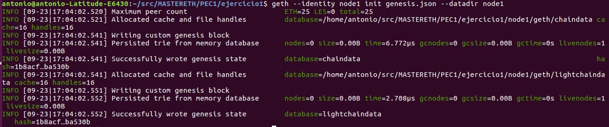

>      geth --datadir node1 --networkid 1 --rpc --rpcaddr "0.0.0.0" --rpcport 8545 --port 30300
    
   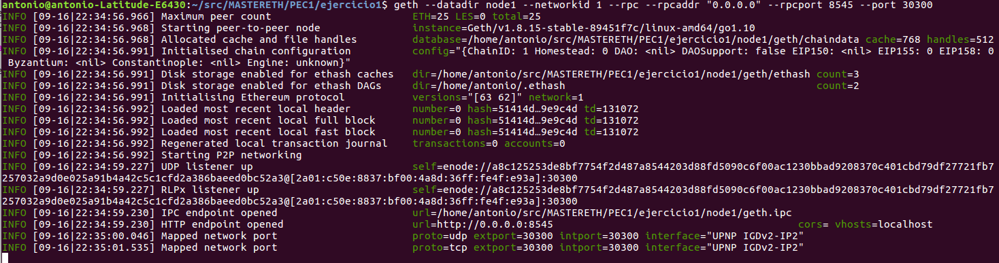

### Balance de la cuenta creada

####  5. Nos conectamos al nodo 1 
>       geth attach ./node1/geth.ipc
   
   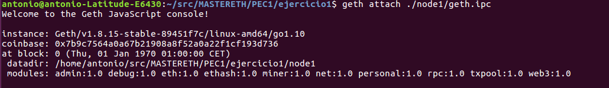

  
####  6. Comprobamos el balance de la cuenta antes de iniciar  el minado 
>      eth.accounts[0] 
>      eth.getBalance("0x7b9c7564a0a67b21908a8f52a0a22f1cf193d736")
   
   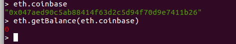

####  7. Iniciamos el minado y comprobamos el balance de la cuenta tras unos minutos
>      miner.start(1)
 
   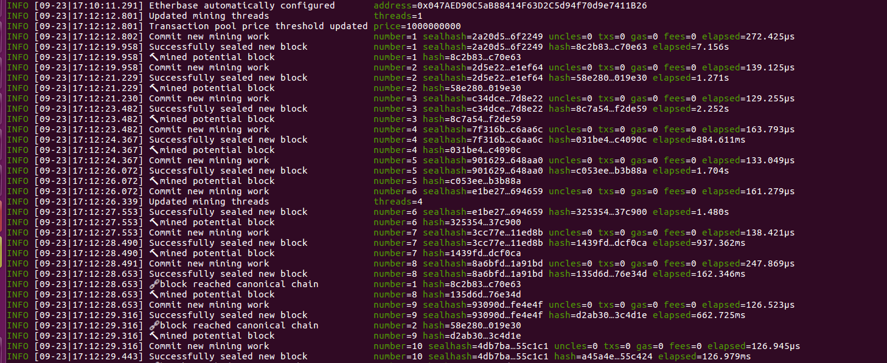

>      miner.stop()
>      eth.getBalance("0x7b9c7564a0a67b21908a8f52a0a22f1cf193d736").
     
   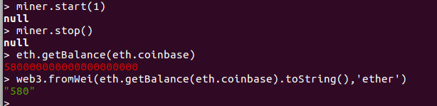
   
~~~ 
El balance de la cuenta tras el minado es 185 ETH
~~~

####  8. Convertimos el balance de wei a ETH 
>     web3.fromWei(web3.eth.getBalance(web3.eth.accounts[0]).toNumber()) 
 
 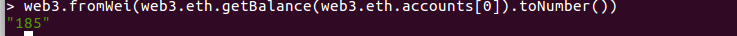

## Ejercicio 2: 

### Información Bloque Genesis de la red Rinkeby

####  1. Iniciamos geth con el modo rinkeby 	
>     geth --rinkeby
   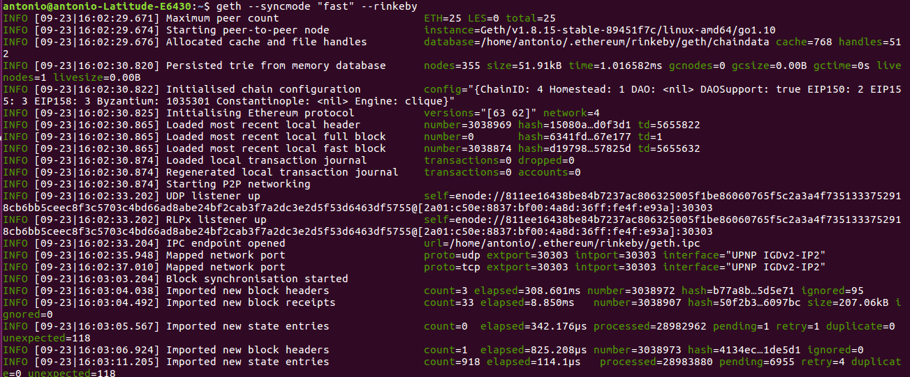

####  2. Desde otro terminal obtenemos la consola
>     geth --datadir=$HOME/.ethereum/rinkeby attach ipc:$HOME/.ethereum/rinkeby/geth.ipc console

   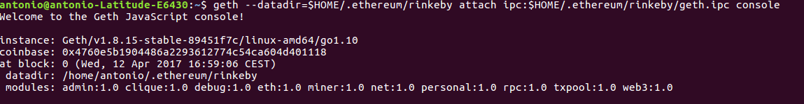

####  3.Desde la consola obtenemos información del nodo
>     admin.nodeInfo

~~~
Hash del bloque genesis: "0x6341fd3daf94b748c72ced5a5b26028f2474f5f00d824504e4fa37a75767e177"
~~~

   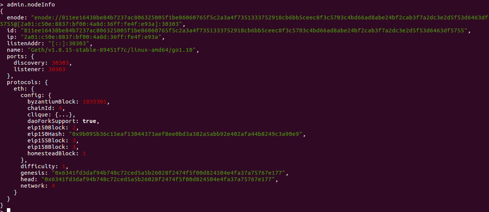
    
####  4.Utilizamos JSON RPC API para obtener información sobre el bloque genesis
>     admin.startRPC("127.0.0.1", 8545)
~~~
Obtenemos información sobre el bloque 0 llamando al método eth_getBlockByHash:
~~~
>	curl -H "Content-Type: application/json" -X POST --data '{"jsonrpc":"2.0","method":"eth_getBlockByHash","params":["0x6341fd3daf94b748c72ced5a5b26028f2474f5f00d824504e4fa37a75767e177", true],"id":1}' http://127.0.0.1:8545

   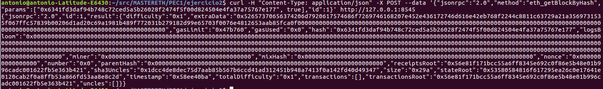

~~~
Podemos obtener la misma información con el método eth_getBlockByNumber:
~~~
>	curl -H "Content-Type: application/json" -X POST --data '{"jsonrpc":"2.0","method":"eth_getBlockByNumber","params":["0x0", true],"id":1}' http://127.0.0.1:8545

>	admin.stopRPC()

   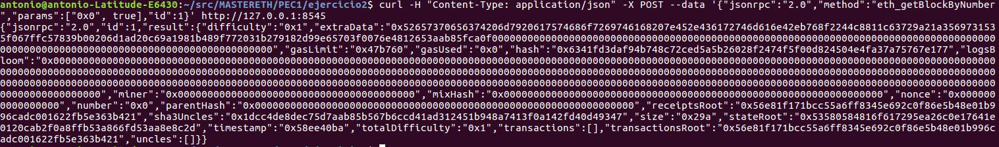

~~~
Las llamadas a eth_getBlockByNumber y eth_getBlockByHash devuelven el mismo resultado que eth.getBlock(0).
~~~
>	eth.getBlock(0)

   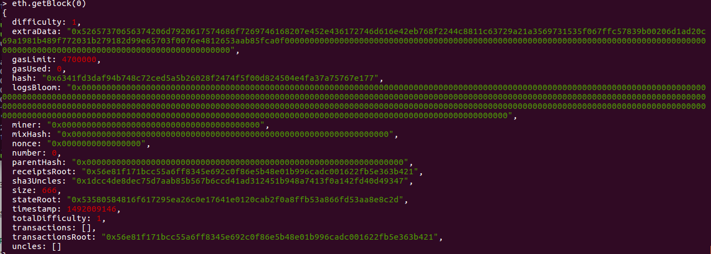

~~~
Si por ejemplo nos fijamos en el valor de gaslimit en hex: 0x47b760 -> al transformarlo en decimal coincide con el valor devuelto por eth.getBlock(0) -> 4700000
~~~

### Cantidad de peers a los que el nodo está conectado

>	web3.net.peerCount 
~~~
El nodo está conectado a 2 peers
~~~

   

### Información acerca de los peers y altura máxima de bloque de los peers

>	admin.peers 

   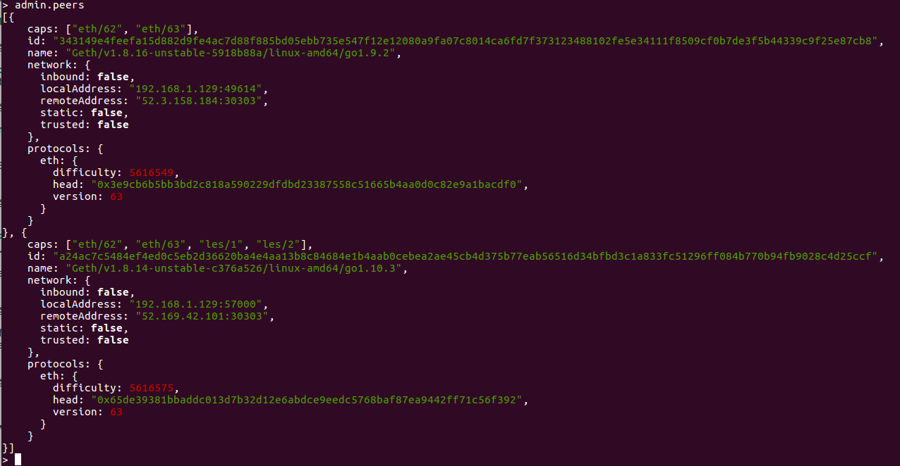

~~~
Desde https://rinkeby.etherscan.io podemos obtener la altura del peer id: 343149e4feefa15d882d9fe4ac7d88f885bd05ebb735e547f12e12080a9fa07c8014ca6fd7f373123488102fe5e34111f8509cf0b7de3f5b44339c9f25e87cb8
mediante el valor del head: "0x3e9cb6b5bb3bd2c818a590229dfdbd23387558c51665b4aa0d0c82e9a1bacdf0"

https://rinkeby.etherscan.io/block/0x3e9cb6b5bb3bd2c818a590229dfdbd23387558c51665b4aa0d0c82e9a1bacdf0
*	Height: 3017748*
~~~
  
 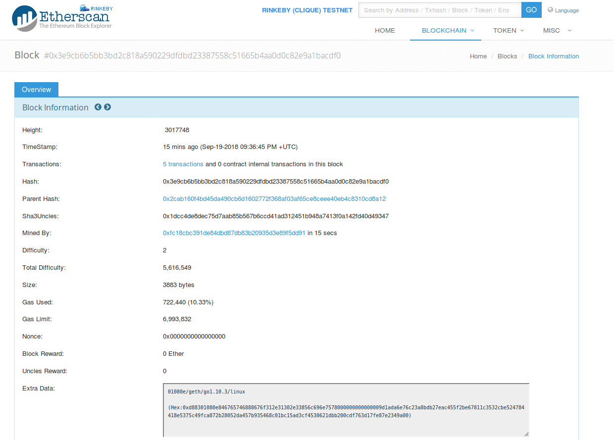

~~~
Desde https://rinkeby.etherscan.io podemos obtener la altura del peer id: a24ac7c5484ef4ed0c5eb2d36620ba4e4aa13b8c84684e1b4aab0cebea2ae45cb4d375b77eab56516d34bfbd3c1a833fc51296ff084b770b94fb9028c4d25ccf
mediante el valor del head: "0x65de39381bbaddc013d7b32d12e6abdce9eedc5768baf87ea9442ff71c56f392"

https://rinkeby.etherscan.io/block/0x65de39381bbaddc013d7b32d12e6abdce9eedc5768baf87ea9442ff71c56f392
*	Height: 3017766*
~~~
  
 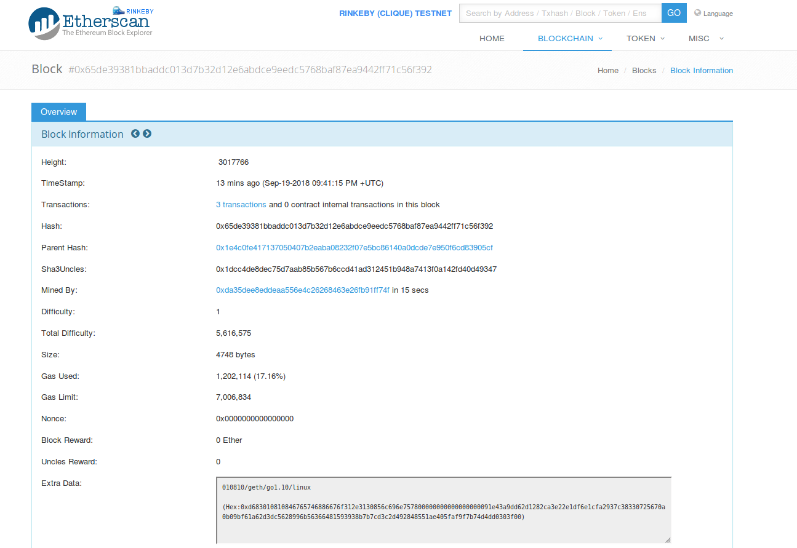

