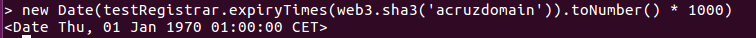
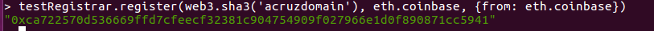
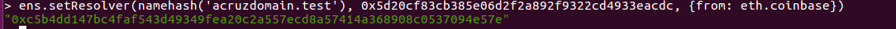
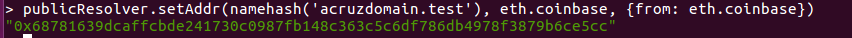
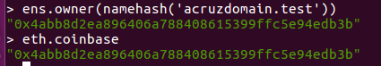
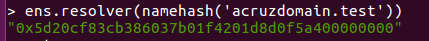

# PEC2:

## Ejercicio 1: Adquisición de un dominio bajo el TLD (Top Level Domain) '.test' en la testnet Rinkeby.

### Descripción del proceso seguido
####  1. Tenemos un nodo completamente sincronizado con la red Rinkeby y habilitada la consola

>  geth --syncmode "fast" --rinkeby
geth --datadir=$HOME/.ethereum/rinkeby attach ipc:$HOME/.ethereum/rinkeby/geth.ipc console

####  2. Importamos ensutils-testnet.js al nodo

	

* ENS se despliega en la red Rinkeby en 0xe7410170f87102df0055eb195163a03b7f2bff4a, donde el TLD '.test' es soportado. 

    1. Desde: "https://github.com/ensdomains/ens/blob/master/ensutils-testnet.js" descargamos ensutils-testnet.js a local
    2. Para poder usar Rinkeby modificamos ensutils-testnet.js:
    ~~~
    contract address: 0xe7410170f87102df0055eb195163a03b7f2bff4a (line 220)
    publicResolver address: 0x5d20cf83cb385e06d2f2a892f9322cd4933eacdc (line 1314)
    ~~~
	3. Cargamos el script
	~~~
	loadScript('./ensutils-testnet.js')
	~~~
	

####  3. Registramos el nombre con FIFS Registrar

   1. Comprobamos que nadie posee el nombre que queremos registrar
   ~~~
   new Date(testRegistrar.expiryTimes(web3.sha3('acruzdomain')).toNumber() * 1000)
   ~~~
   La fecha que obtenemos es anterior a la fecha actual por lo que el nombre no está registrado y podemos continuar.

   

   2. Realizamos la transacción para registrar 'acruzdomain'. 

   Para ello previamente desbloqueamos nuestra cuenta para poder realizar la transacción:
   ~~~
   personal.unlockAccount(eth.coinbase, null, 15000)
   ~~~
   

   Indicamos el nombre del dominio y la cuenta owner del dominio.
   ~~~
   testRegistrar.register(web3.sha3('acruzdomain'), eth.coinbase, {from: eth.coinbase})
   ~~~
   
	

####  4. Establecemos Resolver contract

   1. Indicamos a Registry contract que use el public resolver (dirección del contrato resolver) para nuestro nombre de dominio.
   ~~~
   ens.setResolver(namehash('acruzdomain.test'), 0x5d20cf83cb385e06d2f2a892f9322cd4933eacdc, {from: eth.coinbase})
   ~~~

   

   2. Indicamos a Resolver contract que resuelva el nombre de nuestra cuenta.
   ~~~
	publicResolver.setAddr(namehash('acruzdomain.test'), eth.coinbase, {from: eth.coinbase})
   ~~~

   
       

####  5. Demostramos que somos poseedores del dominio adquirido y obtenemos la dirección del Resolver utilizado

   1. Obtenemos el owner del dominio
   ~~~
   ens.owner(namehash('acruzdomain.test'))
   ~~~
  
   

   2. Obtenemos la dirección del Resolver utilizado
   ~~~
   ens.resolver(namehash('acruzdomain.test'))
   ~~~
  
   
