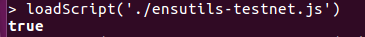
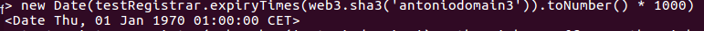
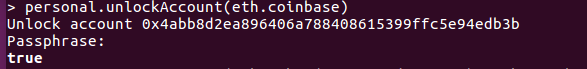
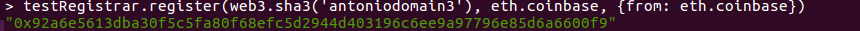
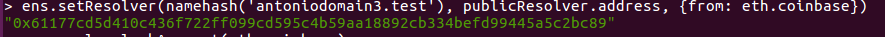
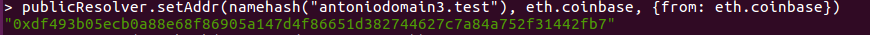
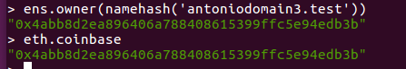
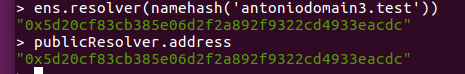
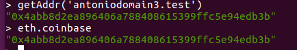

# PEC2:

## Ejercicio 1: Adquisición de un dominio bajo el TLD (Top Level Domain) '.test' en la testnet Rinkeby.

### Descripción del proceso seguido
####  1. Tenemos un nodo completamente sincronizado con la red Rinkeby y habilitada la consola

> -   geth --syncmode "fast" --rinkeby
> -   geth --datadir=$HOME/.ethereum/rinkeby attach ipc:$HOME/.ethereum/rinkeby/geth.ipc console

####  2. Importamos ensutils-testnet.js al nodo

	

* ENS se despliega en la red Rinkeby en 0xe7410170f87102df0055eb195163a03b7f2bff4a, donde el TLD '.test' es soportado. 

    - Desde: "https://github.com/ensdomains/ens/blob/master/ensutils-testnet.js" descargamos ensutils-testnet.js a local
    - Para poder usar Rinkeby modificamos ensutils-testnet.js:
    ~~~
    contract address: 0xe7410170f87102df0055eb195163a03b7f2bff4a (line 220)
    publicResolver address: 0x5d20cf83cb385e06d2f2a892f9322cd4933eacdc (line 1314)
    ~~~
	- Cargamos el script
	~~~
	loadScript('./ensutils-testnet.js')
	~~~
	

####  3. Registramos el nombre con FIFS Registrar

   - Comprobamos que nadie posee el nombre que queremos registrar
   ~~~
   new Date(testRegistrar.expiryTimes(web3.sha3('antoniodomain3')).toNumber() * 1000)
   ~~~
   La fecha que obtenemos es anterior a la fecha actual por lo que el nombre no está registrado y podemos continuar.

   

   - Realizamos la transacción para registrar 'antoniodomain3'. 

   Para ello previamente desbloqueamos nuestra cuenta para poder realizar la transacción:
   ~~~
   personal.unlockAccount(eth.coinbase, null, 15000)
   ~~~
   

   Indicamos el nombre del dominio y la cuenta owner del dominio.
   ~~~
   testRegistrar.register(web3.sha3('antoniodomain3'), eth.coinbase, {from: eth.coinbase})
   ~~~
   
	

####  4. Establecemos Resolver contract

   - Indicamos el public resolver('0x5d20cf83cb385e06d2f2a892f9322cd4933eacdc') que va a resolver nuestro nombre de dominio.
   ~~~
   ens.setResolver(namehash('antoniodomain3.test'), publicResolver.address, {from: eth.coinbase})
   ~~~

   

   - Indicamos a public resolver que nuestro nombre de dominio corresponde a nuestra cuenta coinbase
   ~~~
    publicResolver.setAddr(namehash("antoniodomain3.test"), eth.coinbase, {from: eth.coinbase})  
   ~~~

   
       

####  5. Demostramos que somos poseedores del dominio adquirido y obtenemos la dirección del Resolver utilizado

   - Obtenemos el owner del dominio
   ~~~
   ens.owner(namehash('antoniodomain3.test'))
   ~~~
  
   

   - Obtenemos la dirección del Resolver utilizado. Como vemos corresponde con la dirección del public Resolver
   ~~~
   ens.resolver(namehash('antoniodomain3.test'))
   ~~~
  
   

   - Mostramos la cuenta asociada al dominio (Como vemos coincide con nuestra cuenta coinbase)
   ~~~
   getAddr('antoniodomain3.test')
   ~~~
  
   
