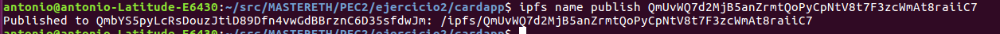

# PEC2:

## Ejercicio 2: Alojar una DApp en IPFS

### A partir de un truffle project modificar el frontend para mostrar su nombre al ejecutar la aplicación

####  1. Clonar el proyecto de una DApp

>  Download DApp from: https://github.com/christinto/ChrisPerry_FinalProject_Consensys/archive/master.zip

####  2. Modifico index.html

  

###  Configurar el entorno

####  1. Iniciamos Ganache Blockchain

> ganache-cli

   

####  2. Compilamos y migramos los smart contracts

> truffle compile
> truffle migrate

   

####  3. Conectamos MetaMask a ganache-cli

  ~~~
   Conectamos MetaMask a ganache-cli en el puerto 8545
  ~~~
	

###  Arrancar un Daemon de IPFS y alojar la DApp
    
####  1. Arrancamos un daemon de IPFS

> ipfs daemon
  
   

####  2. Desde otro terminal comprobamos los nodos a los que estamos  conectados

> ipfs swarm peers 

   

####  3. Consultamos el id de nuestro nodo

> ipfs id

   

####  4. Copiamos los ficheros del frontend a una única carpeta de distribucion (/dist)
> mkdir dist
> rsync -r src/ dist/
> rsync -r build/contracts/ dist/ 
> ls -l dist/

~~~
Necesitamos también los ficheros .json de los contratos (Tenemos las ABI y también información sobre la red donde se han desplegado los contratos)
~~~
   

####  5. Añadimos la carpeta dist a IPFS

> ipfs add -r dist/

~~~
El último hash es el que nos interesa para publicar en IPFS:
QmUxfK9MgusMPHPMLvfxjrJzpV1ZLxuWgHD82pspjTMucp
~~~
  
   

####  6. Publicamos el contenido en IPFS

> ipfs name publish QmUxfK9MgusMPHPMLvfxjrJzpV1ZLxuWgHD82pspjTMucp 
 
   

####  7. Desde un browser accedemos a la DApp en localhost

> localhost:8080/ipns/QmbYS5pyLcRsDouzJtiD89Dfn4vwGdBBrznC6D35sfdwJm/ 

   

####  8. Damos de alta un nuevo vehículo

   
   

####  9. Consultamos el alta

   

####  10. Desde un browser accedemos a la DApp a través del gateway

> https://gateway.ipfs.io/ipns/QmbYS5pyLcRsDouzJtiD89Dfn4vwGdBBrznC6D35sfdwJm/

   

