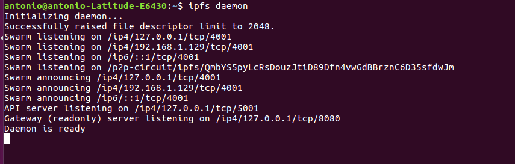

# PEC2:

## Ejercicio 2: Alojar una DApp en IPFS

### A partir de un truffle project modificar el frontend para mostrar su nombre al ejecutar la aplicación

####  1. Clonar el proyecto de una DApp

>  Download DApp from: https://github.com/christinto/ChrisPerry_FinalProject_Consensys/archive/master.zip

####  2. Modifico index.html

  

###  Configurar el entorno

####  1. Tenemos un nodo completamente sincronizado con la red Rinkeby, habilitada la consola

> -   geth --syncmode "fast" --rinkeby
> -   geth --datadir=$HOME/.ethereum/rinkeby attach ipc:$HOME/.ethereum/rinkeby/geth.ipc console
> -   admin.startRPC("127.0.0.1", 8545)
> -   personal.unlockAccount(eth.coinbase, null, 15000)

####  2. Compilamos y migramos los smart contracts

> - truffle compile
> - truffle migrate --reset

   

####  3. Conectamos MetaMask a rinkeby

###  Arrancar un Daemon de IPFS y alojar la DApp
    
####  1. Arrancamos un daemon de IPFS

> ipfs daemon
  
   

####  2. Desde otro terminal comprobamos los nodos a los que estamos  conectados

> ipfs swarm peers 

   

####  3. Consultamos el id de nuestro nodo

> ipfs id

   

####  4. Copiamos los ficheros del frontend a una única carpeta de distribucion (/dist)
> mkdir dist
> rsync -r src/ dist/
> rsync -r build/contracts/ dist/ 
> ls -l dist/

~~~
Necesitamos también los ficheros .json de los contratos (Tenemos las ABI y también información sobre la red donde se han desplegado los contratos)
~~~
   

####  5. Añadimos la carpeta dist a IPFS

> ipfs add -r dist/

~~~
El último hash es el que nos interesa para añadir a IPFS:
QmUvWQ7d2MjB5anZrmtQoPyCpNtV8t7F3zcWmAt8raiiC7
~~~

   

####  6. Desde un browser accedemos a la DApp en localhost

> http://localhost:8080/ipfs/QmUvWQ7d2MjB5anZrmtQoPyCpNtV8t7F3zcWmAt8raiiC7/ 

   

####  7. Damos de alta un nuevo vehículo

   
   
   

####  8. Publicamos el contenido

> ipfs name publish QmUvWQ7d2MjB5anZrmtQoPyCpNtV8t7F3zcWmAt8raiiC7

   

####  9. Desde un browser accedemos a la DApp a través del gateway

> https://gateway.ipfs.io/ipns/QmbYS5pyLcRsDouzJtiD89Dfn4vwGdBBrznC6D35sfdwJm/

   

