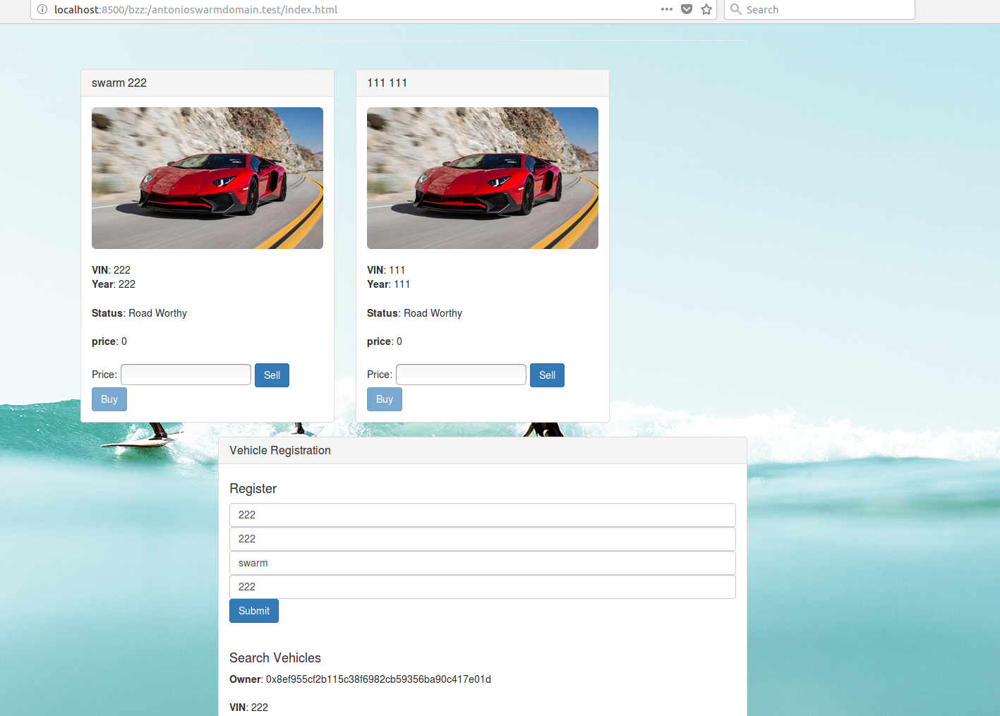

# PEC2:

## Ejercicio 3: Alojar una DApp en Swarm

### A partir de un truffle project modificar el frontend para mostrar su nombre al ejecutar la aplicación

####  1. Clonar el proyecto de una DApp

>  Download DApp from: https://github.com/christinto/ChrisPerry_FinalProject_Consensys/archive/master.zip

####  2. Modifico index.html

  

###  Configurar el entorno

####  1. Tenemos un nodo completamente sincronizado con la red Rinkeby, habilitada la consola

> -   geth --syncmode "fast" --rinkeby
> -   geth --datadir=$HOME/.ethereum/rinkeby attach ipc:$HOME/.ethereum/rinkeby/geth.ipc console
> -   admin.startRPC("127.0.0.1", 8545)
> -   personal.unlockAccount(eth.coinbase, null, 15000)

####  2. Compilamos y migramos los smart contracts

> - truffle compile
> - truffle migrate --reset

   

####  3. Conectamos MetaMask a rinkeby

###  Arrancar Swarm y alojar la DApp
    
####  1. Arrancamos Swarm

> swarm --ens-api 'test:0xe7410170f87102df0055eb195163a03b7f2bff4a@/home/antonio/.ethereum/rinkeby/geth.ipc' --bzzaccount 0x4abb8d2ea896406a788408615399ffc5e94edb3b --datadir=$HOME/.ethereum/rinkeby
  
   

####  2. Copiamos los ficheros del frontend a una única carpeta de distribucion (/dist)
> - mkdir dist
> - rsync -r src/ dist/
> - rsync -r build/contracts/ dist/ 
> - ls -l dist/

~~~
Necesitamos también los ficheros .json de los contratos (Tenemos las ABI y también información sobre la red donde se han desplegado los contratos)
~~~
   

####  5. Subimos la carpeta dist a Swarm

> swarm --defaultpath /home/antonio/src/MASTERETH/PEC2/ejercicio2/cardapp/dist/index.html --recursive up /home/antonio/src/MASTERETH/PEC2/ejercicio2/cardapp/dist

~~~
El hash obtenido es:
0xb81cd7d8ec6d40c5adda0dd42cb1efefa49957ee372641198bfe71590c3864d6
~~~

   

####  6. Vinculamos un ENS adquirido con la DApp 

> - new Date(testRegistrar.expiryTimes(web3.sha3('antonioswarmdomain')).toNumber() * 1000)
> - testRegistrar.register(web3.sha3('antonioswarmdomain'), eth.coinbase, {from: eth.coinbase})
> - publicResolver.address
> - ens.owner(namehash('antonioswarmdomain.test'))
> - ens.setResolver(namehash('antonioswarmdomain.test'), publicResolver.address, {from: eth.coinbase})
> - ens.resolver(namehash('antonioswarmdomain.test'))

  

> - publicResolver.setContent(namehash('antonioswarmdomain.test'),'0xb81cd7d8ec6d40c5adda0dd42cb1efefa49957ee372641198bfe71590c3864d6', {from: eth.coinbase, gas: 100000})
> - getContent('antonioswarmdomain.test')

   

####  7. Mostramos la aplicación con la siguiente URL:

> http://localhost:8500/bzz:/antonioswarmdomain.test/index.html

   

####  8. Damos de alta un nuevo vehículo

   
